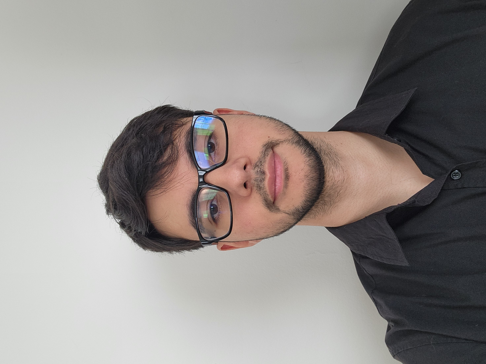
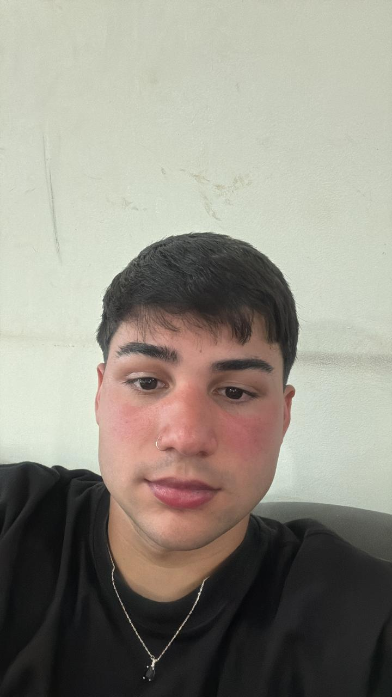
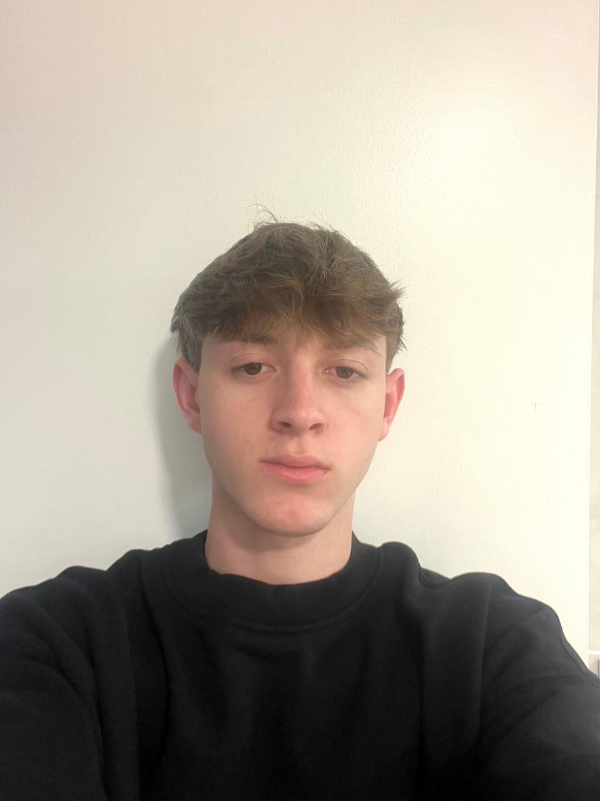
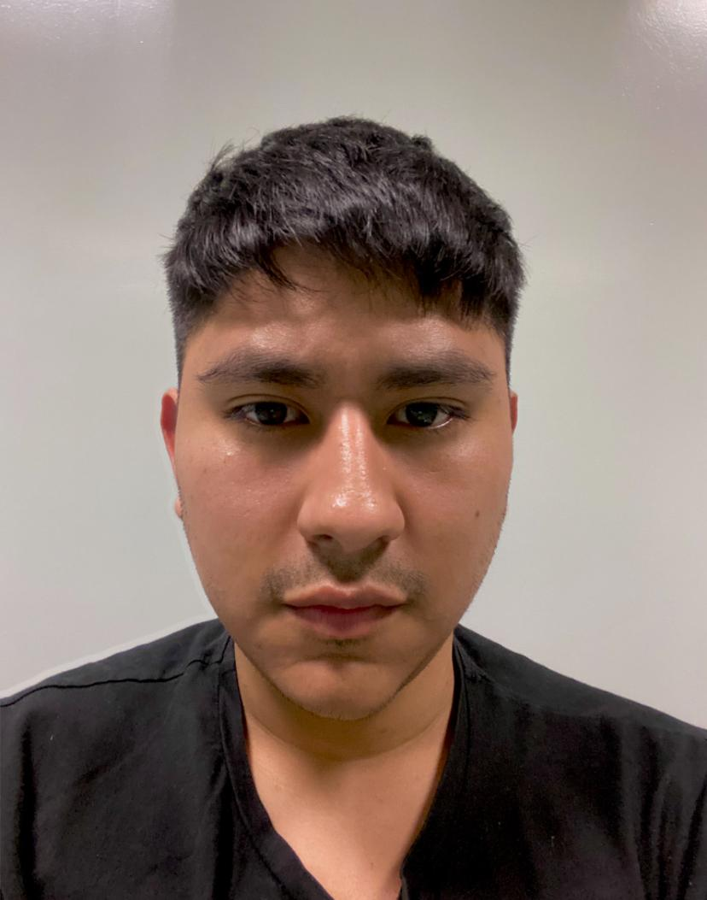

# Ponderados

Trabajo grupal - Programacion 2 - 2026

## Integrantes

| Nombre           | Usuario de GitHub      |
|------------------|------------------------|
| [Santiago Arra]  | [arrasantt]            |
| [Lorenzo Resnik] | [loloresnik]           |
| [Federico Gatti] | [FedeGatt1]            |
| [Marco Teufel]   | [mfteufel]             |
| [Gabriel Rojas]  | [rgabriel2002]         |

## Presentación integrantes

### Lorenzo Resnik 1215403 

Hola, soy Lorenzo, tengo 19 años y estudio Ingeniería Informática. 
De Programación 1 ya tengo algunos conocimientos de Python, así que espero que en Programación 2 pueda seguir mejorando mis habilidades y aprender Java. También me interesa entender mejor la programación orientada a objetos y poder aplicar lo aprendido en proyectos más completos. 
Mi expectativa es poder adquirir una buena base para las materias que siguen y, sobre todo, sentirme cada vez más cómodo programando. 

### Marco Teufel 1132577

Estudio desarrollo de software y me gusta aprender construyendo.
Vengo de trabajar en el sitio web de Serbus (HTML, CSS, JS y SEO), y desde ahí me metí de lleno en la programación.
Con qué trabajo:
Python · Java · JavaScript · SQL
Frontend con React y Next.js, mobile con React Native y Android, y bases de datos con SQL Server.

### Federico Gatti 1224732

Hola soy Federico, estudiante de la carrera en UADE. Estudio Licenciatura en Gestión de Tecnología de la Información.
Con Programación II espero afianzar las bases de Java y de la programación orientada a objetos, mejorar mis habilidades para resolver problemas y escribir código prolijo, y sumar herramientas que después me sirvan en materias más avanzadas. Mi objetivo a futuro es recibirme y poder ejercer lo que estudio, que es lo que realmente me gusta.

### Santiago Arra 1215402

Hola, soy Santiago Arra, tengo 19 años y estudio Ingeniería Informática.
Actualmente estoy cursando en correlativo Programación Orientada a Objetos, así que varios de los temas de esta materia se relacionan bastante con lo que estoy viendo ahí. De Programación 1 tengo una base de Python, pero ahora quiero empezar a meterme más con Java, entender bien cómo funciona y poder manejarme mejor con clases, objetos y todo lo relacionado a POO.
Espero que Programación 2 me ayude a mejorar programando, sumar más práctica y poder hacer programas un poco más completos a medida que avance la cursada.

### Gabriel Rojas 1158074

Mi objetivo principal para este cuatrimestre es afianzar el razonamiento lógico y entender en profundidad cómo funcionan las estructuras de datos "bajo el capó". Me interesa mucho aprender a analizar la complejidad de los algoritmos para escribir código no solo funcional, sino eficiente y escalable. También espero afianzar buenas prácticas de programación, control de versiones y trabajo en equipo para los proyectos prácticos.

## Bitácora

[Ver bitácora](bitacora.md)
